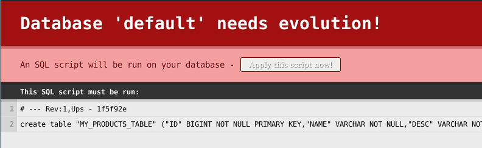
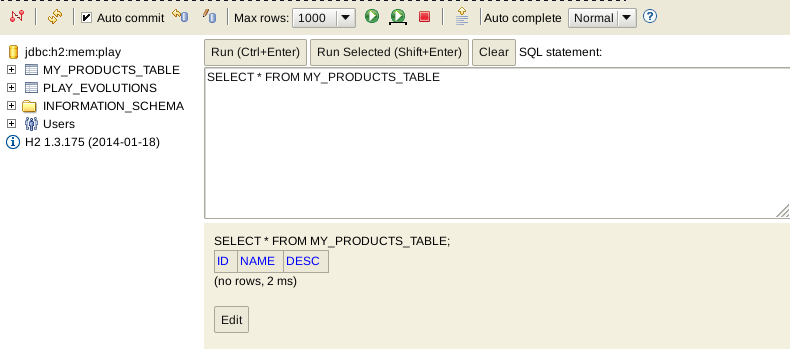
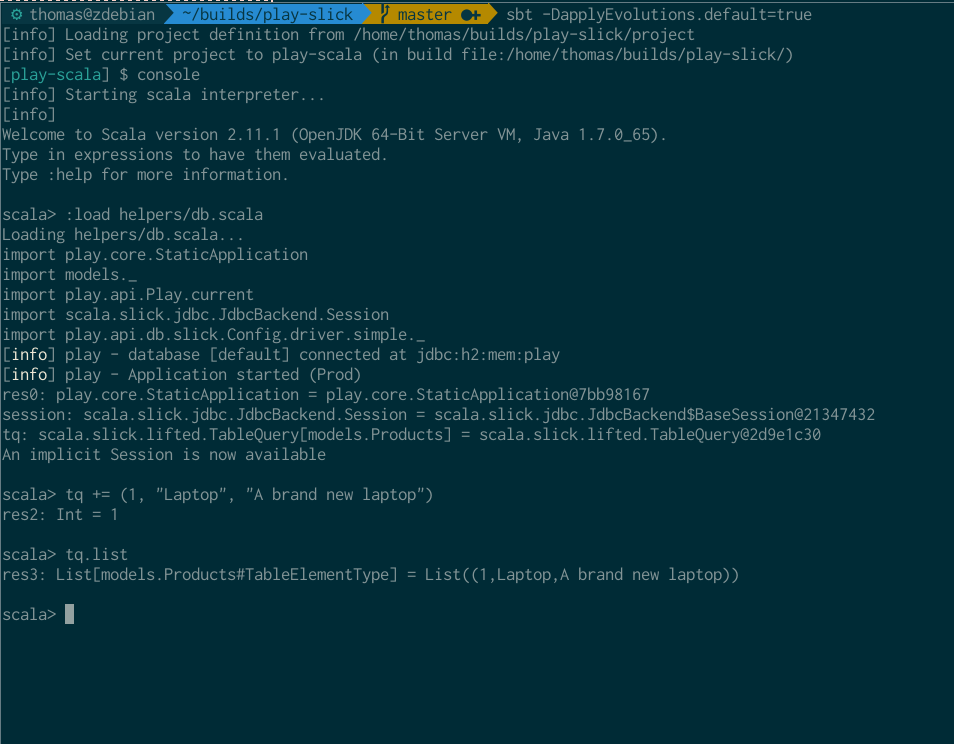

# Slick 2.1 zero to hero (mainly for Play!2)

As I wanted to get started with Slick, I faced a problem every Slick padawan faces: the almost complete lack of resources. There's a rather confusing Activator tutorial, [some docs](http://slick.typesafe.com/doc/2.1.0/), the generated [ScalaDoc](http://slick.typesafe.com/doc/2.1.0/api/#package), and [Adam Mackler's Learning Slick](https://mackler.org/LearningSlick2/). But that's it. And I found neither of those to be particulary easy to read.

But the situation is improving, the official docs now mostly contain everything you should now, though there is no real "path" to follow, and you can't possibly learn it all in one go. Play will probably bring an influx of new Slick users, which will help with the ecosystem.

Here's my try at a easy to follow tutorial that will help you to get started with Slick. Be sure to leave any comments, remarks... Pull requests are also much appreciated!

There's a number of links to the Slick source code. Since most of them refer to line numbers, I linked to the state of a specific commit on GitHub, so we're both looking at the same thing, even when the code is updated.

## Getting set up

I mainly want to learn Slick to use it with Play!2. This guide will work with Play too, because it includes everything you need to get started (it starts the H2 database in memory, shows when your database needs to evolve with the SQL that will be run, it automatically generates those evolutions, an easy way to start the H2 web viewer, etc.). Keep in mind that I'm still learning, I may make mistakes in these recipes, or just be plain wrong.

Here's how you get ready:

1. Install [Typesafe Activator](http://typesafe.com/get-started)
1. Optional but recommended: add Activator to your `PATH`
1. Start Activator UI (with `activator ui`, or `path/to/activator/bin/activator ui` if you didn't add it to your path, or by clicking on the `activator.bat` file if you're on Windows) and create a new project using the "Play Scala Seed"
1. Configure your `application.conf`: enable the default H2 in-memory database, and add or uncomment this line: `slick.default="models.*"`
1. Add the following lines to your `build.sbt` (not all of them are needed for all of the recipes here):

    "com.typesafe.slick" %% "slick" % "2.1.0",
    "com.typesafe.play" %% "play-slick" % "0.8.0",
    "com.h2database" % "h2" % "1.3.175",
    "mysql" % "mysql-connector-java" % "5.1.21"

You should now reload the project.

## Creating a simple table

Let's say we have a simple need: we want to create a table that tracks products. Each product has an ID, name and a description.

A class for our product would look like this:

    case class Product(id: Long, name: String, description: String)

How do we get from a case class to the database?

    package models
    import play.api.db.slick.Config.driver.simple._
    
    class Products(tag: Tag) extends Table[(Long, String, String)](tag, "MY_PRODUCTS_TABLE") {
      def id = column[Long]("ID", O.PrimaryKey)
      def name = column[String]("NAME")
      def description = column[String]("DESC")

      def * = (id, name, description)
    }

That's our basic table. It represents a table in our database. Let's go over this:

1. Since we're working with the Play Framework, we place models in the `models` package
1. We create a new class that inherits from Table, with a type parameter `(Long, String, String)`. The type paramter is used to indicate what kind of data we want to store.
1. For every column we want to create, we make a method. As we have an id of type Long on our case class, we use `def id = column[Long]("ID", O.PrimaryKey)`. The type parameter here obviously defines what kind of data we want to store. Possible values are Byte, Short, Int, Long, BigDecimal, Float, Double, Boolean, java.sql.Date, java.sql.Timestamp, and some more types. You can find a list [here](http://slick.typesafe.com/doc/2.0.0/schemas.html#tables), under the heading Tables. Then comes the name we want for the column in the database, and finally the options we want. Here, the name of the column is "ID", and this column will be a primary key.
1. There's a method called `*` (pronounced "star"), this is the "star projection". Every table needs this. It's defined on [AbstractTable](http://slick.typesafe.com/doc/2.1.0/api/#scala.slick.lifted.AbstractTable), and it must match the row type (type parameter of the `Table` class).

If you run your Play app, you should see this (if you don't, check your `application.conf`: did you uncomment all the database lines, did you add `slick.default="models.*"`?):

Slick generated the following SQL from our `Table`:

    create table "MY_PRODUCTS_TABLE" ("ID" BIGINT NOT NULL PRIMARY KEY,"NAME" VARCHAR NOT NULL,"DESC" VARCHAR NOT NULL)

Clicking on "Apply this script now!" will run that script against the database. You can stop Play and open the H2 web viewer by typing `h2-browser` on the sbt/activator console. If you then apply your script, you'll see a new table in there:

Keep in mind that you won't see anything in the H2 browser if you're doing things in the Scala REPL, because that starts a seperate H2 instance.

## Using case classes instead of tuples

For now, we've created `Table[T]`s with a tuple as the type argument. That tuple can be converted to a class, but then we'd have to do that manually. Fortunately, we can also parameterize `Table[T]` with a class:

    case class Product(id: Long, name: String, description: String)
    
    class Products(tag: Tag) extends Table[Product](tag, "MY_PRODUCTS_TABLE") { 
      def id = column[Long]("ID", O.PrimaryKey)
      def name = column[String]("NAME")
      def description = column[String]("DESC")

      def * = (id, name, description) <> (Product.tupled, Product.unapply _)
    }

The only things we changed were the type argument (`Table[(Long, String, String)]` to `Table[Product]`) and the star projection (`def * = (id, name, description)` to `def * = (id, name, description) <> (Product.tupled, Product.unapply _)`).

The `<>` method is used to [map the star projection to a custom entity type](https://github.com/slick/slick/blob/7925bca085b162cab04f0aec9ff9000a05d620cc/src/main/scala/scala/slick/lifted/AbstractTable.scala#L32). For now, you can just remember that you can use a case class as the `Table[T]` type parameter as long as you use `<>` to map the tuple to that case class.

## Intermezzo: `tupled` and `unapply` with case classes

When we started using case classes instead of tuples, we used two new methods, `tupled` and `unapply`. What's up with them?

    case class Product(id: Long, name: String, description: String)

Remember that we can create new instances of a case class like this (you don't need to use `new`):

    scala> Product(1, "Laptop", "A brand new laptop")
    res0: Product = Product(1,Laptop,A brand new laptop)

Also remember that this is actually sugar for calling the `apply` method:

    scala> Product.apply(1, "Laptop", "A brand new laptop")
    res1: Product = Product(1,Laptop,A brand new laptop)

`unapply` sounds like it's the inverse of `apply`. It's defined on the companion object of the case class:

    scala> Product.unapply(res1)
    res2: Option[(Long, String, String)] = Some((1,Laptop,A brand new laptop))

Hmm, we got back an Option of a triple (`Tuple3`). The tripled is wrapped in an `Option` for the reason defined [here](http://docs.scala-lang.org/tutorials/tour/extractor-objects.html) ("[...] If it returns a single sub-value of type `T`, return an `Option[T]`"). `tupled` goes the other way around: it takes a `Tuple3` and constructs a `Product` for us. This method is also defined on the companion object:

    scala> Product.tupled (2,"Desktop", "A new desktop")
    res3: Product = Product(2,Desktop,A new desktop)

The following is only logical then:

    scala> val product = Product(1, "Laptop", "A brand new laptop")
    product: Product = Product(1,Laptop,A brand new laptop)

    scala> product == Product.tupled(Product.unapply(product).get)
    res4: Boolean = true

## Simple table CRUD

[Relevant documentation on queries](http://slick.typesafe.com/doc/2.1.0/queries.html)

We now have a simple table, but what can we do with it? You might notice there's no methods for data alteration on the `Table` class. Indeed, for data operations, we need an instance of `TableQuery`.

    val tq = TableQuery[Products] // with Products being the Table[Product] we defined earlier

We'll start with the easiest methods available on `tq`.

    tq.list
    tq.insert(Product(1, "Laptop", "A brand new laptop"))
    tq.filter(id === 1)
    tq.filter(id === 1).update(row => (row.name, row.description).update("Desktop", "A brand new desktop"))
    tq.delete
    tq.filter(id === 1).delete
    tq.map(_.id.toUpperCase).run
    tq.length.run

If you want to follow along interactively, see the section "Slick from the REPL".

### Listing all entries (SELECT)

There's a method `list` on `TableQuery[T]` we can use to "list" everything in the database.

    scala> tq.list
    res0: List[models.Products#TableElementType] = List()

Currently, there's nothing in there. If you run the examples in the next section, you should see something like this:

    scala> tq.list
    res1: List[models.Products#TableElementType] = List(Product(1,Laptop,A brand new laptop), Product(2,Eggs,A carton of eggs), Product(3,Bike,A red bike))

### Inserting a new entry (INSERT)

If you thought listing was easy, wait until you see inserting!

#### Inserting a single thing

There are multiple ways to insert things into our table:

    scala> tq.insert(Product(1, "Laptop", "A brand new laptop"))
    res2: Int = 1

Here, we inserted a tuple using `insert`. We can verify this with what we learned in the previous step:

    scala> tq.list
    res3: List[models.Products#TableElementType] = List(Product(1,Laptop,A brand new laptop))

Don't mind the return type. What matters is that the insert succeeded. Another way to insert is to use the `+=` method, which looks more natural:

    scala> tq += Product(2, "Eggs", "A carton of eggs")
    res4: Int = 1

The `+=` method just performs an `insert` under the hood, as proven by [this line in `JdbcInsertInvokeComponent.scala`](https://github.com/slick/slick/blob/d4f019fc13e9cd0311e85152488b63cba44e7119/src/main/scala/scala/slick/driver/JdbcInsertInvokerComponent.scala#L72):

    final def += (value: U)(implicit session: Backend#Session): SingleInsertResult = insert(value)

But look at `res2` and `res1`: `insert` gave us back something, an `Int`. 

To find out what this `Int` means, we'll dig a little. Your bet is probably on "number of inserted rows", and to spoil the fun, you'd be right. If your not interested in this little detour, you can just skip ahead to the next section.

In the definition of `+=` above, where we see it calls `insert`, we also see that it returns a `SingleInsertResult`. This type, described as "The result type when inserting a single value" in the documentation, is defined [here](http://slick.typesafe.com/doc/2.1.0/api/#scala.slick.profile.BasicInsertInvokerComponent$InsertInvokerDef), but there's no implementation. If I understand this, that's up to a specific driver to choose a type to return for an insert.

On trait `CountingInsertInvokerDef` in `JdbcInsertInvokerComponent`, `SingleInsertResult` is defined as an `Int`, and `CountingInsertInvokerDef` is described as "An InsertInvoker that returns the number of affected rows.". You might be wondering how it arrives at that specific `InsertInvoker`, if you also took a look at the [source](https://github.com/slick/slick/blob/d4f019fc13e9cd0311e85152488b63cba44e7119/src/main/scala/scala/slick/driver/JdbcInsertInvokerComponent.scala), you'd see there are multiple `XxxInsertInvokers`. The answer is the type `InsertInvoker[T]`, "The type of insert invokers returned by the driver", which is [set to JdbcDriver.CountingInsertInvokerDef[T]](https://github.com/slick/slick/blob/d4f019fc13e9cd0311e85152488b63cba44e7119/src/main/scala/scala/slick/driver/JdbcInsertInvokerComponent.scala#L16) (the description is in [the docs](http://slick.typesafe.com/doc/2.1.0/api/#scala.slick.driver.JdbcInsertInvokerComponent), I assume inherited from `BasicInsertInvokerComponent` since it's not annotated in the docs - no idea ScalaDoc did this).

#### Inserting multiple things at once

There's also a `++=` operator, which allows us to insert multiple things all at once:

    scala> tq ++= List(Product(3, "Bike", "A red bike"), Product(4, "Milk", "A gallon of milk"))
    res5: Option[Int] = Some(2)

This time, we don't get an `Int`, but an `Option[Int]` back. I don't know why it's wrapped in `Option`, I'm guessing some drivers don't support multiple insert?

### Searching entries (SELECT WHERE)

Now that we have seen how we can select all things in our database, it's time to see how we can filter them. Of course, we could work directly on the result:

    scala> tq.list
    res0: List[models.Products#TableElementType] = List(Product(1,Laptop,A brand new laptop), Product(2,Eggs,A carton of eggs), Product(3,Bike,A red bike), Product(4,Milk,A gallon of milk))

    scala> res0.filter(_.id > 2)
    res1: List[models.Products#TableElementType] = List(Product(3,Bike,A red bike), Product(4,Milk,A gallon of milk))

But that's not a good idea: imagine if this table had tens of thousands of products in it: a list of tens of thousands of products would be returned by the database, and our program would have to sort through them. What a waste, we can offload this task to the database!

To do that, instead of `list`, call `filter` on `tq`:

    scala> tq.filter(_.id > 2L)
    res2: scala.slick.lifted.Query[models.Products,models.Products#TableElementType,Seq] = scala.slick.lifted.WrappingQuery@78d5a6ec

Since we defined `id` as a `Long`, we need to compare it with a `Long`, you'll get an error otherwise. You maybe expected to get back a list of products with an id bigger than 2. But instead, we got back a `WrappingQuery`! What's going on?

Slick wants to avoid making trips to the database, because that's expensive. Instead, it tries combine as much as it can into a query. We can explicitely tell it to run the query with `run`:

    scala> tq.filter(_.id > 2L).run
    res3: Seq[models.Products#TableElementType] = Vector(Product(3,Bike,A red bike), Product(4,Milk,A gallon of milk))

Now we get what we expected! The reason we didn't have to `run` our earlier queries is because they were "complete", what more can you do with an `INSERT INTO`? You can't add a `GROUP BY` or `WHERE`, it's a complete statement and Slick will go ahead and run it, saving you some typing. `list`, you may say, isn't complete, I still could add some clauses to that in SQL! That's true, but since getting everything from a table is so common, `list` will return immediately. If you want to do a `WHERE`, you use `filter` directly on the `TableQuery[T]`. If you want to do a `GROUP BY`, you use `groupBy`.

NOTE paragraph above doesn't seem to be fully true: `groupBy` doesn't need run either. TODO: investigate

You can compose `filters`:

    scala> tq.filter(_.id > 1L).filter(_.id < 4L)
    res4: scala.slick.lifted.Query[models.Products,models.Products#TableElementType,Seq] = scala.slick.lifted.WrappingQuery@446bd64a

    scala> tq.filter(_.id > 1L).filter(_.id < 4L).run
    res5: Seq[models.Products#TableElementType] = Vector(Product(2,Eggs,A carton of eggs), Product(3,Bike,A red bike))

If you want to know what query Slick will run, you can invoke `selectStatement` instead of run:

    scala> tq.filter(_.id > 1L).filter(_.id < 4L).selectStatement
    res6: String = select x2."ID", x2."NAME", x2."DESC" from "MY_PRODUCTS_TABLE" x2 where (x2."ID" > 1) and (x2."ID" < 4)

That looks pretty clean!

What if we want an exact match? We want the product with id 2:
                  
    scala> tq.filter(_.id == 2L)
    <console>:19: error: inferred type arguments [Boolean] do not conform to method filter's type parameter bounds [T <: scala.slick.lifted.Column[_]]
                  tq.filter(_.id == 2L)
                     ^
    <console>:19: error: type mismatch;
     found   : models.Products => Boolean
     required: models.Products => T
                  tq.filter(_.id == 2L)
                                 ^
    <console>:19: error: Type T cannot be a query condition (only Boolean, Column[Boolean] and Column[Option[Boolean]] are allowed
                  tq.filter(_.id == 2L)

This is because we forgot we're not working on real Scala collection. We're working with Slick here. Slick merely provides a collection-like API, that it then translates into SQL queries. To do that, it "lifts" types, you should read about that [here](http://slick.typesafe.com/doc/2.1.0/introduction.html#index-6) first. The take-away is that you can't use `==` because Slick can't override that, instead you should use `===` (and `=!=` instead of `!=`):

    scala> tq.filter(_.id === 2L).run
    res7: Seq[models.Products#TableElementType] = Vector(Product(2,Eggs,A carton of eggs))
    scala> tq.filter(_.id =!= 2L).run
    res8: Seq[models.Products#TableElementType] = Vector(Product(1,Laptop,A brand new laptop), Product(3,Bike,A red bike), Product(4,Milk,A gallon of milk))

### Selecting certain columns (SELECT ..., ...)

When you only need certain columns, you can use `map`. Say we want a list of all the identifiers:

    scala> tq.map(_.id).run
    res9: Seq[Long] = Vector(1, 2, 3, 4)

Multiple columns are just as easy, but we can't use placeholder syntax:

    scala> tq.map(row => (row.name, row.description)).run
    res10: Seq[(String, String)] = Vector((Laptop,A brand new laptop), (Eggs,A carton of eggs), (Bike,A red bike), (Milk,A gallon of milk))

### Updating entries (UPDATE)

For updating, we first need to select the columns we want to update with `map` (we'll run into primary key violations otherwise), then provide a new value for those columns with `update`:

    scala> tq.map(_.description).update("My new description")
    res11: Int = 4

    scala> tq.list
    res12: List[models.Products#TableElementType] = List(Product(1,Laptop,My new description), Product(2,Eggs,My new description), Product(3,Bike,My new description), Product(4,Milk,My new description))

...And it might be a good idea to filter which rows we want to update first:

    scala> tq.filter(_.id === 3L).map(_.description).update("A red bike")
    res13: Int = 1

Take a moment to appreciate how nice this looks!

### Deleting entries (DELETE and DELETE WHERE)

`delete` drops rows from the database:

    scala> tq.delete
    res88: Int = 4

Woops. Just as with `update`, we might want to specify *which* rows, otherwise it goes ahead and deletes all of them:

    scala> tq ++= List(Product(1,"Laptop","A brand new laptop"), Product(2,"Eggs","A carton of eggs"), Product(3,"Bike","A red bike"), Product(4,"Milk","A gallon of milk"))
    res14: Option[Int] = Some(4)
    
    scala> tq.filter(_.id <= 2L).delete
    res15: Int = 2
    
    scala> tq.filter(_.name === "bike").delete
    res16: Int = 0

    scala> tq.filter(_.name === "Bike").delete
    res17: Int = 1

Take a good look at `res16` and `res17`: filtering is case sensitive! If you've worked with SQL before, this may surprise you. You can do a case insenstive match by using `toLowerCase` on the column (see also [this anwer](http://stackoverflow.com/questions/16700370/case-insensitive-string-comparison-in-slick)):

    scala> tq.filter(_.name.toLowerCase === "milk").delete
    res18: Int = 1

This method is not the [toLowerCase you know and love](http://www.scala-lang.org/api/current/index.html#scala.collection.immutable.StringOps@toLowerCase%28%29:String), but an imposter defined [here](https://github.com/slick/slick/blob/d4f019fc13e9cd0311e85152488b63cba44e7119/src/main/scala/scala/slick/lifted/ExtensionMethods.scala#L119). Remember that we're working with lifted types (`Rep[T]`), and that all operations on them happen in the database. Comparing is obvious, but other not all operations are. Slick provides support for a lot of operations with a class called [StringColumnExtensionMethods](https://github.com/slick/slick/blob/d4f019fc13e9cd0311e85152488b63cba44e7119/src/main/scala/scala/slick/lifted/ExtensionMethods.scala#L119). Remember that if you need to perform an operation on a `String` (or rather, `Rep[String]`)!

### Methods on columns

As mentioned in the previous paragraph, not all string operations are possible on a string column (`Rep[String]`), this because not all databases support all of the function Scala has for strings. Those that are, get translated into SQL functions, and are thus performed in the database.

    scala> tq.map(_.name.toUpperCase).selectStatement
    res19: String = select {fn ucase(x2."NAME")} from "MY_PRODUCTS_TABLE" x2

You can view all extension methods, as they are called, [here](https://github.com/slick/slick/blob/d4f019fc13e9cd0311e85152488b63cba44e7119/src/main/scala/scala/slick/lifted/ExtensionMethods.scala#L83). It's definitely worth a quick glance.

### Listing the number of entries (COUNT(*))

`length` shows the number of rows in a table:

    scala> tq.length.run
    res20: Int = 4
    
    scala> tq.filter(_.id > 2L).length.run
    res21: Int = 2

### Inspecting generated SQL

Finally, now that we've seen all these ways to create queries, we can inspect the SQL that Slick generates:

    scala> tq.selectStatement
    res30: String = select x2."ID", x2."NAME", x2."DESC" from "MY_PRODUCTS_TABLE" x2
    
    scala> tq.filter(_.id > 2L).filter(_.name.reverseString === "kliM").map(_.description.toLowerCase).selectStatement
    res31: String = select {fn lcase(x2."DESC")} from "MY_PRODUCTS_TABLE" x2 where (x2."ID" > 2) and (reverse(x2."NAME") = 'kliM')

Similary, we have `insertStatement`, `updateStatement`, `deleteStatement`:

    scala> tq.insertStatement
    res32: String = insert into "MY_PRODUCTS_TABLE" ("ID","NAME","DESC")  values (?,?,?)

    scala> tq.updateStatement
    res33: String = update "MY_PRODUCTS_TABLE" set "ID" = ?, "NAME" = ?, "DESC" = ?

    scala> tq.filter(_.id === 3L).map(row => row.name).updateStatement
    res34: String = update "MY_PRODUCTS_TABLE" set "NAME" = ? where "MY_PRODUCTS_TABLE"."ID" = 3

    scala> tq.deleteStatement
    res35: String = delete from "MY_PRODUCTS_TABLE"

## Slick from the REPL

When on the Play sbt/activator console, you can start an interactive Scala REPL console in the context of your current application by typing the command `console`. When starting a REPL, you first need to start your application and use a Session provider to be able to use the database.

    import play.core.StaticApplication
    new StaticApplication(new java.io.File("."))

This starts the application on the console. If you get messages about evolutions, run sbt with `-DapplyEvolutions.default=true` (see also [this blog post](https://playlatam.wordpress.com/2012/04/01/play-framework-2-quicktip-interactively-play-with-your-application-from-the-scala-console/)).

Now, grab a `Session`:

    import models._, play.api.Play.current, scala.slick.jdbc.JdbcBackend.Session, play.api.db.slick.Config.driver.simple._
    
    play.api.db.slick.DB.withSession {implicit session: Session => 
        // your code
    }

Or create a new session and pass that every time you need it (you don't want to use that wrapper all the time in the REPL!):

    val session = play.api.db.slick.DB.createSession
    TableQuery[Products].list(session) // example usage
    TableQuery[Products].insert((1, "name", "description"))(session) // example insert

Since the session can be passed as an implicit val, we can also do this, and avoid passing it altogether:

    implicit val session = play.api.db.slick.DB.createSession
    TableQuery[Products].list // example usage
    TableQuery[Products].insert(1, "name", "description") // example insert

### Loading a helper from the REPL

Typing all of this into the REPL gets tiring, so one last thing to make our lives easier: we'll create a Scala script and load it from the Scala REPL.

    import play.core.StaticApplication, models._, play.api.Play.current, scala.slick.jdbc.JdbcBackend.Session, play.api.db.slick.Config.driver.simple._

    try {
      new StaticApplication(new java.io.File("."))
    } catch {
      case e: play.api.db.evolutions.InvalidDatabaseRevision => {
        println("\n\n\n WARNING: You should run sbt with the -DapplyEvolutions.default=true switch to automatically apply evolutions!")
        println("Currently, the database is in an invalid state, so queries won't work.")
      }
      case e : Throwable => throw e;
    }

    implicit val session = play.api.db.slick.DB.createSession
    val tq = TableQuery[Products]
    println("An implicit Session is now available")

I saved it as `db.scala` in a folder `helpers` in my project root. You can now use the REPL's special `:load` command to load it:

## Classes you'll meet

### The `Table` class

### The `TableQuery` class

### The `ProvenShape` class

### The `Rep` class

## The big O

Remember how we used `O.PrimaryKey` to set a field as a primary key? That `O` is defined [here](http://slick.typesafe.com/doc/2.1.0/api/#scala.slick.profile.RelationalTableComponent$Table) and contains some more interesting things for `JdbcProfile` ([official documentation here](http://slick.typesafe.com/doc/2.1.0/schemas.html#table-rows), scroll down a little):

1. `O.PrimaryKey`: non-compound primary key
1. `O.Default[T](defaultValue: T)`: set a default value
1. `O.DBType(dbType: String)`: use a custom database type (e.g. `DBType("VARCHAR(20)")`)
1. `O.AutoInc`: automatically increment this field
1. `O.NotNull`: this field may not be null
1. `O.Nullable`: this field may be null

Note on `O.NotNull` and `O.Nullable`: you should usually not specify these. Slick will use nullable database fields by default if you use an `Option` type.

### Auto-increment

We don't always want to provide primary keys ourselves. Here, we want to save stores, but we'd rather have the database set the id:

    case class Store(id: Long, name: String)
    
    class Stores(tag: Tag) extends Table[Store](tag, "STORES") {
      def id = column[Long]("id", O.PrimaryKey, O.AutoInc)
      def name = column[String]("name")

      def * = (id, name) <> (Store.tupled, Store.unapply _)
    }

We just give the id the `AutoInc` option. If we insert a `Store`, we can see the database sets the id:

    scala> TableQuery[Stores] += Store(666, "Eurostock")
    res0: Int = 1

    scala> TableQuery[Stores].list
    res1: List[models.Stores#TableElementType] = List(Store(1,Eurostock))

Note that the id we provided ourselves (`666`) gets ignored, erased if you will, and the database sets a new one.

That's not really kosher, we need to set an id that's non-sensical, since it gets overwritten by the database. It would be much nicer if we could make this explicit in the type system. We'll start with a new class that tracks locations:

    case class Location(id: Long = None, address: String)

It tracks locations with an id. Since we want this id to be set by the database, we'll make it an `Option`:

    case class Location(id: Option[Long] = None, address: String)

We would like to our table to look like this:

    class Locations(tag: Tag) extends Table[Location](tag, "LOCATIONS") {
      def id = column[Long]("id", O.PrimaryKey, O.AutoInc)
      def address = column[String]("address")

      def * = ???
    }

So we save locations with an `id` `None`, and the database will generate an id. In case we insert a location with an id of `Some(x)`, it will be ignored and a new one will be generated. When we get data from the database, we want it to be of the correct type (`Location`), with the `id` being `Some(x)`. We can do that without a lot of pain, we define the `*` projection as

    def * = (id.?, address) <> (Location.tupled, Location.unapply _)

Note `id.?`: this method is defined on [PlainColumnExtensionMethods](http://slick.typesafe.com/doc/2.1.0/api/#scala.slick.lifted.PlainColumnExtensionMethods) and is used for `Option` types in the `*` projection.

Now everything works as expected: we can pass in ids of `None` and we get back `Locations` with an `id` of `Some(x)`!

    scala> TableQuery[Locations] += Location(None, "21 Jump Street")
    res2: Int = 1

    scala> TableQuery[Locations].list
    res3: List[models.Locations#TableElementType] = List(Location(Some(1),21 Jump Street))

## Multiple primary keys

You can use the `primaryKey` method in your `Table` definition to define multiple primary keys, the syntax is:

    def pk = primaryKey("pk_name_here", (someColumn, anotherColumn, oneMoreForGoodMeasure))

## Mapping columns

As mentioned before, you can't store arbritrary types in the database. Those that can't be saved have to be mapped either as a table (classes) or to other types. You can map a column using [MappedColumnType](http://slick.typesafe.com/doc/2.1.0/api/index.html#scala.slick.memory.MemoryQueryingProfile$MappedColumnType).

Let's say we want to track events. We want to keep track of the id, description and timestamp of the event. The timestamp keeps track of when the event happened:

    case class Event(id: Long, description: String, timestamp: java.util.Date)

    class Events(tag: Tag) extends Table[Event](tag, "EVENTS") {
      def id = column[Long]("id", O.PrimaryKey)
      def description = column[String]("description")
      def timestamp = column[java.util.Date]("timestamp")

      def * = (id, description, timestamp) <> (Event.tupled, Event.unapply _)
    }

This won't work, `java.util.Date` isn't a type you can persist. So we'll write a mapper from `java.util.Date` to `java.sql.Timestamp`. `java.util.Date` cannot be directly persisted in the database, so we "map" it to a type that can (and stores the same kind of data), `java.sql.Timestamp`. We could also have mapped the date to a `Long`, or to a `String`, but a timestamp is what we want.

    implicit val javaUtilDateMapper = MappedColumnType.base[java.util.Date, java.sql.Timestamp] (
        d => new java.sql.Timestamp(d.getTime),
        d => new java.sql.Date(d.getTime)
    )

1. We define this as an `implicit val`. This will allows us to ignore this is a mapped column for all practical purposes.
1. The name we give this `val` doesn't matter, but well-named things are nice
1. We call the factory method `MappedColumnType.base[T,U](tmap: T => U, tcomap: U => T)`. `T` is the type we want to use externally, in this case, `java.util.Date`. `U` is what we want the database to use, here: `java.sql.Timestamp`. Then come `tmap` and `tcomap`, which are functions that define how to convert from `T` to `U` and back.
1. We pass the conversion functions as anonymous functions.

We'll place this implicit in the table. The full code now looks like:

    case class Event(id: Long, description: String, timestamp: java.util.Date)

    class Events(tag: Tag) extends Table[Event](tag, "EVENTS") {
        implicit val javaUtilDateMapper = MappedColumnType.base[java.util.Date, java.sql.Timestamp] (
            d => new java.sql.Timestamp(d.getTime),
            d => new java.sql.Date(d.getTime)
        )
        def id = column[Long]("id", O.PrimaryKey)
        def description = column[String]("description")
        def timestamp = column[java.util.Date]("timestamp")
    
        def * = (id, description, timestamp) <> (Event.tupled, Event.unapply _)
    }

We can confirm this works:

    scala> val ev = TableQuery[Events]
    ev: scala.slick.lifted.TableQuery[models.Events] = scala.slick.lifted.TableQuery@626bcfa6

    scala> ev += Event(1, "Mainframe is down", new java.util.Date)
    res1: Int = 1

    scala> ev.list
    res2: List[models.Events#TableElementType] = List(Event(1,Mainframe is down,2015-01-26))

    scala> res2(0).timestamp
    res3: java.util.Date = 2015-01-26

We pass in `java.util.Date`s and get back `java.util.Date`s, while not thinking about how it's saved in the database!

## Using Global.scala to inject sample data

1. Enable Global.scala in `application.scala`
1. Override `def onStart(app: Application)`

## What's "lifted embedding"? What's "direct embedding"?

### Lifted embedding

### Direct embedding

## Connecting to a different database engine

### MySQL

### Supported engines
